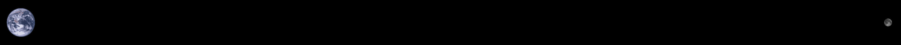
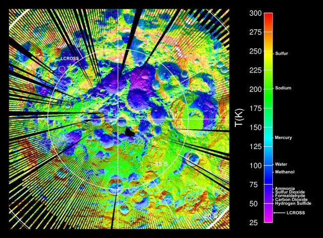

# Where to go?

It's so hard to get to another planet that the only reasonable options to go to first are the closest ones; the Moon, Venus, and Mars.  

# Our Moon

The moon is quite close and has wonderful views.  

Distance to scale ([wiki](https://www.notion.so/48eab292781d4ab79f2fc33db70ee185#1c23b6479f6641c2bb8370f496f4c81d))

There's no air, it's very dusty, and has about 15% gravity.  The days are 13 days long and the nights are also 13 days long (one moonth).  Because the days are so long the surface can get a bit toasty - about 120 degrees Celcius so you might want to live at the North or South Pole if you don't want your shoes to melt.

Temperature of the Moon at the South Pole

Hopefully there's some water in craters so we can do our laundry and take luxurious showers.

Another problem is that there's no carbon or nitrogen which you need to make people ([wiki](https://en.wikipedia.org/wiki/Geology_of_the_Moon#Elemental_composition)).

# Venus

Venus is one of the two planets closest to the Earth but it's 400 Degrees which is a bit of a show stopper.  Venus also boasts an atmosphere which is about 100 times thicker than Earth's. ([wiki](https://en.wikipedia.org/wiki/Venus)). 

Blimp-life:

You might be able live above Venus in a blimp.  50km above the surface the weather is quite nice and a blimp full of Earth's atmosphere would float.  So you could hang out there ... in a blimp ([wiki](https://en.wikipedia.org/wiki/High_Altitude_Venus_Operational_Concept)). 

# Mars

Mars kind of wins by default.  Its nearby.  The days are about 24 hours.  The gravity is 37%.  It has all the elements that are needed for life.  It's pretty cold - colder than the South Pole, but the max temperature is about 30 degrees C, which is doable.  The atmosphere is very thin but better than no atmosphere at all.  

Living on Mars would be a little bit like living in Antarctica with low gravity and space suits.  

Since there's liquid water and the other necessary elements there might be living things on Mars.